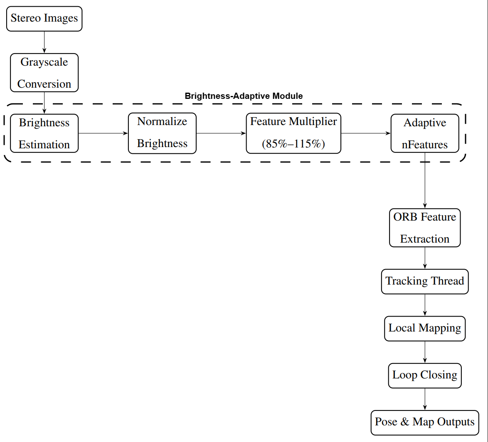
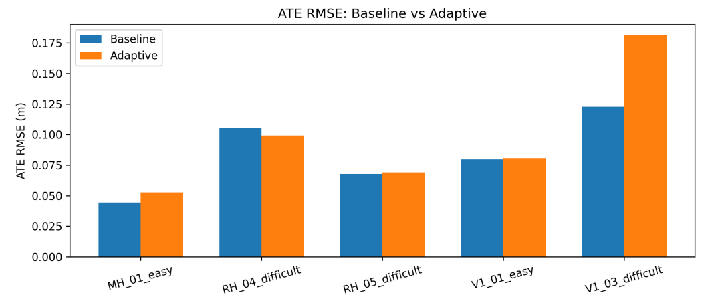

# Environment-Adaptive ORB-SLAM3 Feature Extraction

Brightness-adaptive ORB feature extraction for improved robustness in visual SLAM systems operating under varying illumination conditions.

This project extends the ORB-SLAM3 feature extraction pipeline by dynamically adjusting FAST detection thresholds and the target number of ORB features based on real-time scene brightness. The adaptive approach increases feature density in darker environments while reducing redundant computation in well-lit scenes, maintaining minimal runtime overhead.

---

## System Architecture

The adaptive module is integrated directly inside the ORB extractor and operates before feature distribution. Downstream SLAM components — tracking, local mapping, and loop closing — remain unchanged.

---

## Overview

Standard ORB-SLAM3 uses fixed feature extraction parameters across all frames. However, lighting conditions strongly influence keypoint detection quality and tracking stability.

This project introduces a lightweight adaptive strategy that:

- Computes mean frame brightness in real time
- Normalizes brightness to a 0–1 range
- Dynamically adjusts FAST detection thresholds
- Scales the ORB feature budget between **85%–115%** of baseline

All modifications were designed to preserve the original ORB-SLAM3 architecture and threading model.

---

## Implementation Details

Key modifications were implemented inside the ORB extractor:

- Brightness estimation using `cv::mean(image)`
- Adaptive FAST threshold scaling between `fIniThFAST_MAX` and `fIniThFAST_MIN`
- Dynamic adjustment of target feature count:

nfeatures = nOriginalFeatures * featureMultiplier

Where:

featureMultiplier ∈ [0.85 , 1.15]

Behavior:

- Dark scenes → increased feature density  
- Bright scenes → reduced feature count for efficiency

---

## Key Results

**Observations**

- Comparable performance on easier sequences
- Improved robustness on challenging lighting conditions (e.g., MH04 difficult)
- Negligible runtime overhead (<1% variation)

---

## Setup / Applying Changes

This repository does **not** include the full ORB-SLAM3 source code.

Clone ORB-SLAM3 separately:

git clone https://github.com/UZ-SLAMLab/ORB_SLAM3.git

Apply the adaptive modifications:

./scripts/apply_changes.sh /path/to/ORB_SLAM3

Then rebuild ORB-SLAM3 following the upstream instructions.

---

## Evaluation

Datasets:

- EuRoC Machine Hall (MH01, MH04, MH05)
- EuRoC Vicon Room (V101, V103)

Metrics:

- Absolute Trajectory Error (ATE)
- Runtime
- CPU utilization
- Memory usage

Full analysis available in:

report/Report.pdf

---

## Credits / Upstream

This work builds upon:

ORB-SLAM3  
https://github.com/UZ-SLAMLab/ORB_SLAM3

Original authors:  
Campos, Elvira, Gómez Rodríguez, Montiel, Tardós

---

## Author

Brayden Currier  
Computer Engineering
